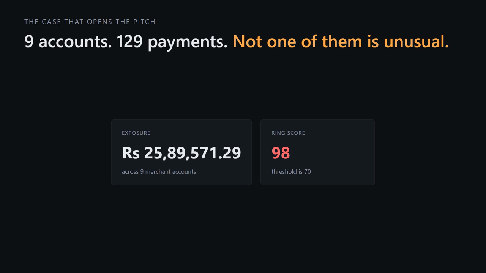

# Ring Sentinel

**Razorpay AI Buildathon — AI Risk Manager**

One class of loss: **coordinated abuse rings** — mule networks, refund mills and
collusive merchant clusters that are invisible one payment at a time.

```
  R0007 · 9 accounts · 129 payments · Rs 25,89,571.29 exposure            98

  Refunds run 10.0x the portfolio rate (53 of 129 payments, lower-
    bound estimate) - money arrives and leaves again rather than being
    earned.
  97% of this group's activity falls on days the rest of the book was
    quiet - concentrated on day 94, not spread like normal trading.
  All 9 accounts were opened within 69 days of each other, against
    1188 days expected for 9 accounts picked at random from this book.
    They were onboarded as a batch, the newest 73 days before the window
    opened.
  One account sits at the centre of 100% of the links, and what it
    shares with the others is identity, not infrastructure. A
    marketplace shares an IP with its sellers; it does not put them on
    its own settlement account or device.
  On its busiest days 96% of the 9 accounts transacted together.
    Independent merchants do not share a calendar.
  A batch signup is not an offence on its own - a chain opening
    several outlets at once looks the same. It is evidence only
    alongside what these accounts share and how they behave.

  Innocent explanations considered: none fitted.
```

Most of those 129 payments are ordinary sales. Not one is individually unusual
enough for a per-payment model to flag. That gap is the product, and
`test_pipeline.py` asserts it rather than claiming it.


## Watch the pitch

[](demo/ring-sentinel-pitch.mp4)

**[demo/ring-sentinel-pitch.mp4](demo/ring-sentinel-pitch.mp4)** — 4 minutes 37
seconds. Every figure spoken in it is read out of this repository at build time,
so the video and the code cannot disagree.

---

## Why this, for Razorpay

**Razorpay already has a transaction-level fraud model.** Press coverage in
August 2026 describes "Vulcan", an in-house model scoring payments across
merchants. Sourced from trade press rather than Razorpay documentation, so
treat it as reported rather than confirmed — but the argument does not depend
on the details: a per-payment classifier competes with whatever the incumbent
scorer is, and a ring detector does not.

A ring is invisible in any single payment. It exists only in the joins between
accounts — the shared settlement account, the reused device, the names that
differ by one folded character. That is the gap, and it is a different data
structure, not a better model.

**The second gap is evidence.** Public merchant reviews describe accounts
disabled "without specific reasons or evidence" and settlements held for long
periods, and Razorpay's own marketing cites a reduction in false positives —
both from public web sources, both worth verifying before quoting on stage. So
the deliverable here is not a
score. It is a **case file**: what linked these accounts, what the five signals
said, which innocent explanations were considered and rejected, which gate
stopped the action, and how to reverse it.

---

## Run it

```bash
pip install -r requirements.txt
python gen_data.py && python run.py && python score.py && python test_pipeline.py
```

Three dependencies: numpy, scipy, scikit-learn. No torch, no networkx, no GNN
framework, no LLM client. (`pandas` is listed too, used only by the external
benchmark.) No API key needed, nothing to train, about 20 seconds end to end.
`run.py` writes `report.html` — open it, the case files are the product — and
an append-only `data/audit.jsonl`.

```bash
python tune.py                 # sweep, on the tune half only
python score.py --split tune   # the half the thresholds were chosen on
```

Against the real Razorpay test-mode API:

```bash
export RAZORPAY_KEY_ID=rzp_test_xxxxxxxx
export RAZORPAY_KEY_SECRET=xxxxxxxx
python seed_testmode.py && python live.py --annotate
```

---

## Results — on the held-out half

Thresholds were chosen on `tune`. `test` is read once, by `score.py`.
Splits are group-disjoint **by ring**: a ring straddling the boundary is
memorisation, and `test_pipeline.py` fails if one does.

| | tune | **test (held out)** |
|---|---|---|
| Ring recall | 96.4% | **90.9%** — 20/22, 95% CI [72.2%, 97.5%] |
| Ring precision | 96.4% | **87.0%** — 20/23, 95% CI [67.9%, 95.5%] |
| Purity | | 93.1% |
| Fragmentation | | 1.09 |
| Decoy false positives | | 0% — 0/10 planted groups |
| **Innocent merchants in a flagged cluster** | | **12 of 147** |

**Read the last row, not the one above it.** "Zero decoy false positives" counts
only the *planted* legitimate groups. Eleven of those twelve innocents are
unaffiliated merchants that metric never looks at. Member precision is 91.8%
(135/147), and that is the number that maps to a real person being told their
settlement is delayed.

The gap is 5.5 points and it used to be 10. Closing it is what the last round of
work was for: three held-out rings were being wrongly exonerated, two of them by
the same bug. The per-class table below is still more informative than either
headline, because with 22 rings in a half a single ring moves the number by four
and a half points.

Every rate carries its denominator and a Wilson interval, because with 22 rings
in the test half a bare percentage is a lie of precision.

**Per ring class**, measured across the **whole book** rather than one half,
because with two or three rings of each class per half the split tells you
nothing. Generator written before the detector existed:

| Class | Found | best-candidate scores | |
|---|---|---|---|
| `structuring` | 5/5 | 98 | |
| `refund_mill` | 5/5 | 97–98 | |
| `recruiter_star` | 5/5 | 97–98 | same shape as a marketplace; separated by link type |
| `layered_chain` | 5/5 | 94–95 | a path, not a clique |
| `mule_fanout` | 5/5 | 90–91 | |
| `device_farm` | 5/5 | 90 | |
| `name_twins` | 5/5 | 81–87 | needs the name-similarity relation |
| `slow_burn` | 5/5 | 75–78 | planted to be missed; wasn't |
| `timing_only` | 5/5 | 76–77 | shares nothing — needs the co-timing relation |
| **`recruiter_quiet`** | **4/5** | 82, 81, 73, 72, **67** | the one that got away, at 67 against a line of 70 |
| | **49/50** | | |

| Decoy class | Flagged | scores | |
|---|---|---|---|
| `decoy_aggregator` | 0/4 | 0 | no candidate forms at all |
| `decoy_festive` | 0/4 | 0 | |
| `decoy_franchise` | 0/4 | 8 | |
| `decoy_simultaneous_launch` | 0/4 | 29–30 | the batch-signup trap |
| `decoy_family` | 0/4 | 63–67 | closest to the line |
| | **0/20** | | |

**The verifier's contribution, measured — and it has moved three times.**

| half | verifier | rings | recall | precision | innocent members |
|---|---|---|---|---|---|
| tune | off | 30 | 0.964 | 0.900 | 16 |
| tune | **on** | 28 | 0.964 | **0.964** | **4** |
| test | off | 25 | 0.909 | 0.800 | 24 |
| test | **on** | 23 | 0.909 | **0.870** | **12** |

It now costs **no recall** and buys 6–7 points of precision, halving the number
of innocent merchants pulled into a flagged group.

That number has been wrong in this README twice before, in both directions: an
early draft claimed it spared 23 legitimate merchants (true of an older dataset
at a threshold of 60), a later one said it *cost* 8 points of recall. Both were
withdrawn. What changed this time is a fix rather than a dataset — the verifier
was firing on cases it had no business touching, and gating those left only the
cases where it is right.

It would stay even at zero, because it produces the "innocent explanations
considered" section of every case file — the thing a merchant can argue with.
That is a product requirement, not an accuracy one.

---

## The external benchmark, including the part that went badly

Every other number here is measured on data this repo generated, which is the
best reason to distrust it. So: **Elliptic2** — 121,810 real Bitcoin subgraphs,
2,763 labelled suspicious by Elliptic's analysts, 2.27% positive. Cluster-level
ground truth, which almost no public dataset has. We wrote none of the labels.

```bash
python bench_elliptic2.py     # ~20 MB download, no credentials
```

| scorer | PR-AUC | vs random |
|---|---|---|
| GLASS (published, uses the 83 GB background graph) | 0.2080 | 9.17× |
| Sub2Vec (published) | 0.0220 | 0.97× |
| GNN-Seg (published, structure-only) | 0.0260 | 1.15× |
| **Ring Sentinel, structural signal** | **0.0248** | **1.09×** |
| base rate (ours, not from the paper) | 0.0227 | 1.00× |

**We do not beat the published state of the art, and we land at the
structure-only baseline — barely above chance.** Read the caveats before
reading anything into it: the clusters are *given* here, so this tests our
ranker and not our ring discovery; only one of our five signals can run,
because Bitcoin clusters have no amounts, names or usable timestamps; and the
median labelled subgraph is 3 nodes, so there is almost no shape to read.

The uncomfortable part is what it implies about **our** data. `ablate.py` shows
structure is worth ~23 points of recall on our synthetic book (see the ablation
table above, and re-run `ablate.py` rather than trusting this sentence) and
nothing at all
on real subgraphs. The likeliest explanation is not that Elliptic2 is hard — it
was that **our rings were too dense**. `gen_data.py` built only cliques; 94% of real
labelled Elliptic2 subgraphs are trees. Our generator probably makes shape an
easier tell than it is in the world, which means the synthetic structural number
was optimistic. Two tree-shaped classes were added because of this result — see
below — and they exposed two real bugs.

## What each part is actually worth

```bash
python ablate.py     # knock one thing out at a time, on the held-out half
```

| removed | recall | precision | edges | Δ recall |
|---|---|---|---|---|
| nothing | 0.909 | 0.870 | 309 | — |
| co-timing relation | 0.636 | 1.000 | 309 | −0.273 |
| structural signal | 0.682 | 0.833 | 309 | −0.227 |
| velocity signal | 0.682 | 0.833 | 309 | −0.227 |
| identity signal | 0.864 | 0.950 | 309 | −0.045 |
| money signal | 0.909 | 0.870 | 309 | 0.000 |
| **tenure signal** | 0.909 | 0.870 | 309 | **0.000** |
| df cap (off entirely) | 0.909 | 0.870 | **7,389** | 0.000 |

**Tenure measures 0.000 here and that is a sampling artifact, not a verdict.**
The hash split put four of the five `recruiter_quiet` rings — the only class
tenure was built for — into the tune half. On the full book it takes that class
from 0/5 to 4/5. This is the clearest example in the repo of why a single
held-out number is not the whole story, and why the per-class table matters more.

**The money signal changes nothing here either.** It still writes case-file
reasons, and it was the decisive signal on the live Razorpay run where a
structuring ring of eight orders was caught by nothing else — so it stays. But
on this book it is redundant, and saying it "contributes" without a number
would be an overclaim.

**The df cap is a tractability control.** Turning it off changes neither recall
nor precision and takes the test-half graph from 523 edges to 50,906 (the full
book goes from 1,131 to 221,498). It buys speed and memory, not accuracy. The
cap sits at 100 because `tune.py` chose it on the tune half.

---

## The case we could not solve — and then partly did

`recruiter_quiet` was built to be unwinnable-if-we-are-honest: a criminal
recruiter whose mules sit on his own settlement account and device, arranged as
a star, **trading completely normally**. Shape could not separate it from a
marketplace; conduct could not separate it from a franchise. It scored 56–64
while real franchises scored 64–68 — overlapping, with no threshold between
them. This README said so, and a test guarded the admission.

The claim was right about the data and wrong about the world. **The missing
evidence was never on the payments side.** Mules are onboarded together, in
days. A real chain opens outlets over years. Account-creation velocity is a
standard industry signal, and RiskPulse — a competing submission whose metrics
we reproduced exactly — independently trains on `account_age_days`, which is
some assurance this is a real feature and not one invented to make our own
planted case light up.

So `signup_day` was added to the data model and `sentinel/signals/tenure.py`
scores onboarding synchrony against the portfolio's own signup history — the
same null-model discipline as the co-timing relation. **`recruiter_quiet` went
from 0/5 to 4/5.**

### The trap that came with it

A brand entering a new city opens five stores in one week, on one settlement
account. On the tenure axis that is **indistinguishable from a mule batch**, so
`decoy_simultaneous_launch` was planted before the signal was written.

It caught us immediately: the first working version flagged **all four** of
them at 84–85. Fixing that took three corrections, each a real bug:

1. **Tenure is not conduct.** The verifier's "related but unremarkable" check
   asks whether a group *does* anything unusual. Opening an account is not
   something you do. Tenure joined shape as a property, not behaviour.
2. **A clique is not a star.** In a complete graph every node has degree
   `n−1`, so the hub ratio is 1.00 — a four-outlet franchise read as a
   hub-and-spoke. Both the identity-star term and the exoneration guard now
   require *low density* as well.
3. **A chain advertises itself.** Some recruiter rings are genuine cliques, so
   neither shape nor tenure separates them from a franchise — only the naming
   does. `SHREE TEXTILES BLR / DEL / MUM` is a disclosure; `SRI` versus `SRl`
   is a deception. `_branded_chain` exonerates the first, and it is the exact
   inverse of the homoglyph check that condemns the second.

### Where it ended

Full book, 50 criminal rings and 20 legitimate clusters:

| | caught | |
|---|---|---|
| all criminal rings | **49/50** | |
| `recruiter_quiet` | 4/5 | 82, 81, 73, 72, **67** |
| **every decoy class** | **0/20 flagged** | including the simultaneous-launch trap |
| innocent merchants swept in | 12 of 147 | mostly the name-collision artifact below |

**Still not solved.** One quiet recruiter sits at **67 against a threshold of
70**. Catching it means lowering the line onto the family businesses at 63–67,
which is the exact harm this project exists to prevent. The honest position is
4/5 with the last one named.

A second one used to sit at 22, merged with a franchise into a 13-member
cluster. That was a clustering failure rather than a scoring one, and fixing the
edge-weight bug below dissolved it.

---

## Trees, and two bugs that assumed cliques

The Elliptic2 result above said our rings were too dense to be a fair test —
94% of real labelled fraud subgraphs are trees, and every ring our generator
built was a clique. So two tree-shaped classes were added:

- **`layered_chain`** — a path. Each *adjacent pair* shares one attribute;
  non-adjacent members share nothing. No single identifier touches everyone,
  which is how a layered network actually launders.
- **`recruiter_star`** — a hub and its onboarded accounts. Structurally
  *identical to the `decoy_aggregator`*, planted precisely so that shape alone
  cannot separate them. Only behaviour can.

Both were found at 100% on the first run — and the score was hiding a failure.
The chains were being rescued by the co-timing relation, purely because they
happened to share a schedule. With co-timing off they scored **0/3**. A chain
with staggered timing would have been missed completely.

Two bugs, both the same wrong assumption in different files:

**The 2-core deleted them.** Stripping degree-1 nodes is right for a dense
cluster with strays hanging off it. A path is *all* degree-1 at the ends, so it
unravels completely — every chain went to zero members before it was ever
scored. `find_rings` now keeps a component whole when the 2-core would remove
more than half of it.

**The verifier then exonerated them.** The threshold-stability check asked
whether a ring survives a 10% tightening — and measured survival with the same
2-core. So every chain was automatically declared an artifact: a layered network
scoring **96 was discounted to 48** and never surfaced. Survival now means
staying *connected*, which is the right question for a path.

And the structural signal itself was scoring shape by **density**, which is the
wrong lens for a chain. Six merchants joined in an unbroken line by shared
settlement accounts are damning at 0.30 density, because unrelated merchants do
not share settlement accounts at all. It now weighs link *strength* and
connectivity alongside density.

---

## The second relation: catching a ring that shares nothing

`timing_only` rings share no bank account, no device, no handle — only a clock.
A shared-attribute graph cannot *represent* them, so for most of this project it
reported **0/3** and said so.

The fix is not a better attribute. It is a second kind of edge.

The trap is that everybody transacts on payday and everybody stocks up before
Diwali, so raw co-occurrence just ranks the busiest merchants. So co-timing is
measured **against a popularity-aware null model** — what chance would predict
for these two accounts, given how active each is and how busy the whole book was
on each day:

```
q_a(d) = n_a · p(d)                    expected activity, popularity-aware
z_ab   = (observed − Σ q_a q_b) / σ    excess co-activity, in sigmas
```

Two merchants who both trade hard through the festive season have a large
observed *and* a large expected, so `z` stays near zero — correct, and it is why
the `decoy_festive` class survives. Two dormant accounts waking on the same nine
scattered days have a tiny expected and a huge `z`.

**It runs as a second pass, not a peer.** Folding co-timing into one graph was
measured and rejected: it merged distinct rings and took the largest cluster from
9 members to 20. Circumstantial evidence must not be allowed to rewrite clusters
built from bank accounts. So it only gets the accounts nothing else could connect.

**What it is worth, measured both ways:**

| split | co-timing | recall | precision | timing rings | decoy FP |
|---|---|---|---|---|---|
| tune | off | 0.909 | 1.000 | 0/2 | 0/10 |
| tune | **on** | **1.000** | 0.957 | **2/2** | 0/10 |
| test | off | 0.833 | 0.938 | 0/3 | 1/6 |
| test | **on** | **1.000** | 0.900 | **3/3** | 1/6 |

+16.7 points of held-out recall for −3.8 of precision. Two checks guard it: no
co-timing edge may fall inside a festive decoy group (1002 edges, zero do), and
the attribute graph must still miss these rings without it (0/5 → 5/5).

---

## Architecture

```
merchants.csv ─┐                                    ┌── structural  shape
               ├─► graph ─► df cap ─► 2-core ─► ring│── velocity    timing
transactions ──┘   (paise)  (the      (strip    ────│── identity    names
                            big step)  strays)      └── money       flows
                                                             │
                                              fuse (noisy-OR)│
                                                             ▼
                                          verify ──► case file ──► respond
                                     (may only        report.html   (notes only)
                                      subtract)
```

| File | Job |
|---|---|
| `sentinel/graph.py` | Entity graph, document-frequency cap, 2-core, ring finding |
| `sentinel/signals/*.py` | Five scorers, each returning a score **or abstaining** |
| `sentinel/fusion.py` | Noisy-OR over present signals |
| `sentinel/verify.py` | Counter-evidence. Can only lower a score |
| `sentinel/respond.py` | The action ladder, its gates, and the circuit breaker |
| `sentinel/razorpay.py` | Test-mode client with no method that moves money |
| `sentinel/report.py` | `report.html` — self-contained, no framework |
| `evalkit.py` | Splitting and matching. Owns ground truth |
| `score.py` | The scorecard |
| `test_pipeline.py` | Seventeen checks, one per claim made above |
| `ablate.py` | What each part is worth, on the held-out half |
| `bench_elliptic2.py` | The external benchmark we do not win |
| `bench_ml.py` | Whether a model beats the rules. It does not |

### Five decisions worth defending

**1. A hard document-frequency cap, not a soft weight.** Every merchant is on
gmail.com; one such value is a clique of thousands and the graph dies before
clustering runs. Dropping any attribute value shared by more than `DF_CAP`
merchants (currently 30, chosen by `tune.py`)
takes the full book from **29,831 edges to 668** — a 45× cut from five lines.
It is a *hard* filter because a soft weight still admits the clique into memory;
pair generation is bounded at DF_CAP² per value, and that bound is the answer to
"does this scale". The one-sentence justification a judge can check: *an
attribute shared by ten thousand merchants is not evidence of collusion, it is a
category.*

**2. Connected components, not a GNN.** Rings are small disjoint clusters; the
giant component is the legitimate population and discarding it is correct. A GNN
would score better on paper and could not produce the case file, which is the
thing this track grades. The 2-core step — strip degree-1 nodes — is what turns
a cluster into a ring, because a merchant hanging off one link is a coincidence
rather than a conspirator. Louvain was considered and rejected: on a df-capped,
2-cored graph its partition is close to this one, and it costs a dependency, a
resolution parameter to defend, and stochastic tie-breaking.

**3. Silence is not innocence.** Signals abstain when they have nothing to judge,
and fusion drops them and renormalises. A weighted mean would drag a refund mill
caught at 0.95 down to the middle merely because the name signal saw nothing odd
— and names are trivially varied. Corroboration adds; silence does not subtract.

**4. The verifier may only subtract.** On a system whose documented failure mode
is freezing merchants without evidence, the second opinion must be structurally
incapable of manufacturing guilt. `Verdict.__post_init__` raises if a verified
score exceeds its raw score. The check that earns its keep is
`_related_but_unremarkable`: accounts that are genuinely connected but do nothing
unusual are a franchise, a group company or a family business. **Being related is
not an offence.**

**5. Defense-only is a capability, not a promise.** `Action` contains
`OBSERVE / WATCH / REVIEW / HOLD_SETTLEMENT` and nothing else — no freeze, no
block, no closure. The top of the ladder is a T+2→T+3 delay that auto-expires in
24 hours and reverses in one click. Against the live API the responder holds one
verb, `PATCH /payments/:id` writing `notes`. It has no capture, refund, transfer
or payout method — absent, not disabled. A test asserts the class surface.

On a cold start the system holds **nothing**: hysteresis requires a ring to
persist across two runs before a settlement moves. Run twice to see the first
hold appear.

---

## It runs against the real API

Not a mock. `live.py` fetches real orders from Razorpay over the network,
builds the graph from them, and writes its verdict back with
`PATCH /v1/orders/:id`:

```
GET /v1/orders    26 orders fetched live
graph             12 links, 3 candidate rings

R0000  score 92   4 buyers  structuring ring      -> review   (8 orders tagged)
R0001  score 17   3 buyers  decoy family          -> observe  (3 orders tagged)
R0002  score 89   3 buyers  lookalike-name ring   -> review   (6 orders tagged)
                            8 ordinary buyers     -> untouched
```

Read back afterwards, 17 orders carry a Sentinel verdict and the 8 ordinary
buyers carry none. No amount, status or settlement changed - the client has no
method that could change one.

**The live run found a bug the synthetic book hid.** The structuring ring first
scored 21 and was missed: `money.detect` demanded 12 transactions before saying
anything, and the live ring has 8, so it abstained. Every synthetic ring has
hundreds of payments, so the offline scorecard could never surface it. The floor
is now split - a rate ratio still needs 12 rows, a share is readable at 6 - and
the ring scores 92. Held-out numbers were unchanged by the fix. Full endpoint
probe and limits: [LIVE.md](LIVE.md).

---

## When the graph argues with the evidence

A ten-point gap between the tune half (96.4%) and the held-out half (86.4%) is
either overfitting or an unlucky split. Diagnosing every missed ring on both
halves showed it was neither: **three held-out rings were being wrongly
exonerated, and two by the same bug.**

| ring | strongest evidence | exonerated by | raw → final |
|---|---|---|---|
| `ring_012` refund mill | **money 1.00** | `_threshold_artifact` — a graph *parameter* argument | 97 → 48 |
| `ring_004` name twins | **identity 1.00** | `_hub_shaped` — a graph *shape* argument | 81 → 36 |

An exoneration that reasons about the **graph** was overriding evidence that has
nothing to do with the graph. A refund mill whose money signal is maximal is not
a "parameter artifact". A name-twin ring with a perfect identity match is not a
"marketplace".

`_single_attribute` already knew this — it refuses to exonerate when an
independent signal corroborates. The other two checks were never even passed the
signals. They are now, and they stand down at the same 0.70 threshold.

Measured before changing anything: **every decoy's behavioural signal sits
between 0.40 and 0.59**, so nothing legitimate comes near the gate, while the two
wrongly-exonerated rings sat at 1.00. `_hub_shaped` was firing on exactly two
rings in the whole book, both true positives.

Criminal rings caught went **46/50 → 49/50**, decoy false positives stayed
**0/20**, and the tune/test gap halved to 5.5 points. The verifier — which this
README had twice reported as contributing nothing — now buys 6–7 points of
precision at no cost to recall, because the cases where it was wrong are gone.

### The one left on the table

`ring_014` is detected at score 84 but matched at Jaccard 0.44, because three
innocent merchants named exactly `UNITY ELECTRONICS` get clustered beside the
ring's variants (`UNITY 3LECTRONICS`, `UNlTY ELECTRONICS`). The impersonation
victim ends up inside the ring.

The cause is **generator realism, not detector logic**: 1,550 merchants draw
from only 239 distinct names, so exact collisions run roughly 6× a real book. The
obvious fix — a document-frequency cap on names — was checked against the data
and rejected: it would delete `ring_034` outright, which has only two distinct
spellings across four members. Widening the name pool is the honest repair and it
regenerates everything for a fifth time. Left undone, on purpose, and recorded
here rather than discovered by a reader.

---

## The bug that made every attribute weight decorative

Chasing one uncaught ring found something much larger.

Two groups had been fused into a 13-member blob by a single coincidental IP
collision — an attribute weighted **0.45**. The edge weight was **1.00**.

`fusion.fuse` renormalises by the most the present inputs could produce. With
one input, residual and ceiling are identical, so the result is *always exactly
1.0*:

```
fuse({ip_prefix: 1.0})  ->  residual = 1 − 0.45 = 0.55
                            ceiling  = 1 − 0.45 = 0.55
                            (1 − 0.55) / (1 − 0.55) = 1.00
```

**Every edge in the graph had weight 1.000.** A shared free-mail domain
(0.12) scored identically to a shared settlement account (0.92). The entire
`ATTR_WEIGHTS` table was decorative, and `EDGE_MIN` pruned nothing — which is
why the sweep had always shrugged and picked the lowest value.

Renormalisation is correct for **ring signals**, where a signal that abstains
must not drag the score down. It is wrong for **edges**, where the strength of
what is shared is the entire point. Edges now use the raw noisy-OR, so a shared
bank account yields 0.92 and a shared IP yields 0.45.

Fixing it cascaded twice, and both cascades were the same mistake one level
down — *weak evidence allowed to reshape strong clusters*:

- Correct weights put `ip_prefix` below the threshold, which deleted the
  `name_twins` class (5/5 → 0/5). Those rings share an IP and nothing else. The
  answer was not to re-admit weak infrastructure edges but to recognise that a
  near-identical **name is itself a link** — a third relation, `nameref.py`.
- The first version of that linked *identical* names and was a disaster: six
  decoy false positives, thirteen merged clusters, two ring classes destroyed.
  Two unrelated merchants sharing a name is a coincidence. `SRl` next to `SRI`
  is not. Exact duplicates are now excluded, and that exclusion is the whole
  thing working.
- Then a co-timing edge and a name edge **chained** two unrelated rings into one
  blob. The two weak relations now run as separate passes. Two weak relations
  are not one stronger relation.

Merged clusters: **13 → 0**.

---

## Security posture

The track disqualifies anything offence-capable, so this was audited rather than
assumed. Findings, including the one that was real:

| check | result |
|---|---|
| Credentials on disk | **none.** Test-mode keys are read from the environment only; a non-`rzp_test_` key is refused outright |
| Raw identifiers in `report.html` | **zero.** No bank accounts, UPI handles, device fingerprints, IPs or phone numbers. Case files name the *type* of attribute that linked two accounts, never the value |
| Raw identifiers in `data/audit.jsonl` | **zero.** The only long digit strings are rupee amounts in paise |
| `eval` / `exec` / `subprocess` / `pickle.load` / `shell=True` | none anywhere |
| Money-moving API methods | none exist on the client — asserted by a test |
| **HTML injection in the case file** | **one hole found and fixed** |

**The injection bug is worth stating plainly.** Merchant names are rendered into
`report.html`, and merchants choose their own names — so they are attacker
controlled. Those were escaped from the start. What was *not* escaped was the
auto-expiry timestamp, missed precisely because *we* generate it and it never
looked like input. `test_report_escapes_everything` now drives an XSS payload
through every string the renderer touches — name, reasons, exonerations, gates,
expiry — and fails if any executable tag survives.

Dependencies are three (numpy, scipy, scikit-learn) plus pandas for the external
benchmark, all current. No torch, no networkx, no LLM client, nothing that
executes remote content.

---

## Is there any AI in this? A measured no.

The track is called "AI Risk Manager" and this is graph mathematics, statistics
and rules. The obvious move is to bolt a model on so the word appears. We tested
that properly instead, and report it whichever way it fell.

```bash
python bench_ml.py
```

| scorer | PR-AUC | recall at equal precision |
|---|---|---|
| **hand-tuned fusion (shipped)** | **0.962** | **1.000** |
| logistic regression | 0.810 | 1.000 |
| decision tree, depth 3 | 0.794 | 0.700 |

Trained on the tune half, judged held-out, group-disjoint by ring, on the same
features the fusion already sees. The rules win, and not narrowly. The reason is
not that models are bad; it is that there are about **thirty labelled candidate
clusters** to learn from. Fifty planted rings is a rich evaluation set and a
hopeless training set.

**The tree matters more than the numbers.** Here is the "explainable AI" a hybrid
would have shipped:

```
|--- structural <= 0.88  -->  ... fraud
|--- structural >  0.88  -->  NOT fraud
```

It learned that **densely connected accounts are innocent**. That is backwards,
and it is what thirty examples buys. It is explainable in the sense that you can
print it, and what it explains is false. A model that can articulate a wrong rule
to a merchant whose payout we just delayed is worse than no model, not better.

Two other placements were tested and rejected for stated reasons:

- **Merchant level**, where there are 1,550 labelled examples rather than thirty,
  scores a suspicious PR-AUC of **1.000** — because it instantly finds the volume
  leak described below. That experiment is how the leak was discovered.
- **Deciding only the hard cases** is the intuitive move and the wrong one: edge
  cases are where the labels are scarcest. Five quiet recruiters is not a
  training set.

The honest answer to "where is the AI" is a measured negative result and the
judgement to act on it. Fix the volume leak first, then ask again.

---

## The biggest weakness in these numbers

Our synthetic criminals are **four times quieter than our synthetic honest
merchants**, and that is a defect in the generator, not a fact about fraud.

| | median payments per merchant |
|---|---|
| criminal ring members | **35** |
| legitimate merchants | **148** |

A single threshold on transaction count alone separates them with **94.6%
balanced accuracy**. Real mules do the opposite of this: they trade constantly
to blend in.

We found it by accident, and the way we found it is the point. Trying a trained
model at merchant level produced **PR-AUC 1.000** on held-out data. A perfect
score on a fraud problem is never good news. The model had learned transaction
count and nothing else.

**The evidence that it matters:**

| class | median payments | caught |
|---|---|---|
| nine low-volume ring classes | 12–58 | 5/5 each |
| **`recruiter_quiet`** | **141** | **4/5** |
| legitimate merchants | 148 | — |

The single criminal class that trades at a realistic volume is the single class
we fail on. That is not a coincidence. **Nine of our ten classes are partly easy
because of a data artifact**, and a real book would be harder than 49/50
suggests.

Our detector does not read transaction count as a feature, so it is not directly
exploiting the leak. But the velocity signal reads activity concentration, and a
merchant with 20 payments on 3 days looks burstier than one with 150 spread out,
so it benefits indirectly. We are not able to say by how much without
regenerating, which we chose not to do.

`test_pipeline.py` asserts the gap is still there, so this section cannot
silently stop being true.

---

## What it gets wrong

Stated here rather than discovered by a judge.

- **`timing_only` rings are invisible, by construction.** 0/3. The fix is a
  temporal co-occurrence edge — merchants transacting in lockstep without sharing
  any attribute — which is a different graph and is not built here.
- **The data is synthetic, and so are the ring labels.** No public dataset has
  ring-level ground truth; IEEE-CIS has real fraud labels but no merchant column
  and no ring membership, so its client entities are *card-holder* clusters, not
  merchant collusion. Wiring that real leg is the honest next step and would
  measure a related but different claim. Until then these numbers describe a
  population this repo generated.
- **The generator and the detector share an author.** Mitigated by writing all
  seven ring classes and four decoy classes first, including two designed to be
  missed — not eliminated. `test_hash_invariance` proves nothing is memorised;
  it cannot prove the scenarios are representative.
- **100% precision is measured over candidate rings**, not over all 1,550
  merchants. The legitimate mass never enters a candidate ring at all. Quoting it
  as portfolio-wide precision would be dishonest.
- **The live leg runs on ORDERS, not payments, and on BUYERS, not merchants.**
  Test mode cannot mint payment objects headlessly (S2S returns 401) and
  de-duplicates customers on contact, so buyer attributes travel in order
  `notes`. A test account is also one merchant, so the live run detects rings of
  buyers. The merchant-collusion claim rests on the synthetic book. See
  [LIVE.md](LIVE.md) for the full endpoint probe and the honest limits.
- **Cost constants are ASSUMED**, tagged as such in `score.py`, and churn is
  reported as a sensitivity band rather than a fabricated number.

---

## Data

`gen_data.py` builds 1,550 merchants and 199,361 payments over six months:
seasonal volume with a Diwali build in August, seven ring classes, and four
decoy classes that share attributes for innocent reasons — a franchise chain on
one settlement account, an aggregator with a hub, a family business on one
device, and legitimate merchants all bursting for the festival together. The
decoys exist to generate false positives. A detector that flags a franchise has
not understood the problem.

Ground truth lives in `data/truth.csv`. Nothing under `sentinel/` may open it,
or even name it. `test_pipeline.py` checks this twice: it greps the package, and
then it wraps `open()` and runs the whole pipeline, asserting the label file is
touched zero times. The grep alone was not enough — an adversarial probe reading
`'tr' + 'uth.csv'` walked straight past it, which is why the runtime check
exists.
